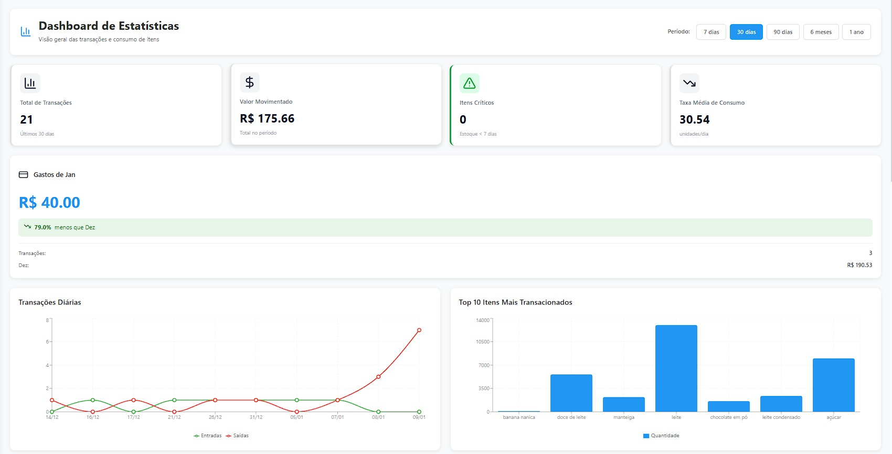
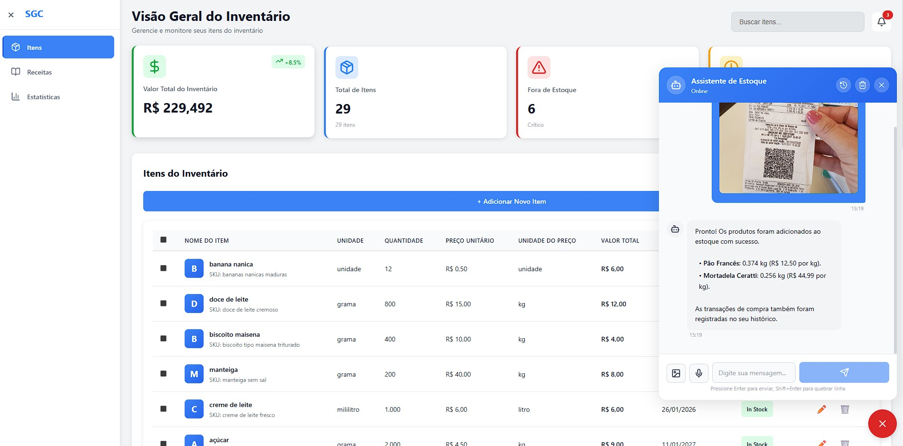

# SGC - Sistema de Gerenciamento de Compras

<div align="center">


**Sistema inteligente de gerenciamento de itens, receitas e transações com IA**

[Visão Geral](#-visão-geral) •
[Tecnologias](#-tecnologias) •
[Arquitetura](#-arquitetura) •
[Instalação](#-instalação) •
[Interface](#-interface-do-usuário) •
[Estrutura](#-estrutura-do-projeto) •
[API](#-documentação-da-api)

</div>

---

## Visão Geral

O **SGC (Sistema de Gerenciamento de Compras)** é uma aplicação full-stack inteligente que utiliza agentes de IA baseados em LangGraph para gerenciar itens, receitas, transações e fornecer insights sobre compras e culinária. O sistema oferece:

- **CRUD completo** de Itens, Receitas e Transações
- **Chatbot Inteligente** com múltiplos agentes especializados
- **Dashboard de Estatísticas** com visualização de dados
- **Busca e extração** de informações de áudio e imagens
- **Conversão de unidades** e cálculo de custos
- **Busca web** para informações externas
- **Estruturação automática** de receitas e itens via IA

### Características Principais

- **Multi-Agent System**: Arquitetura baseada em agentes especializados (Orchestrator, SQL, Web, Structurer, Revisor, Trivial, Extractor)
- **LangGraph Workflow**: Fluxo de trabalho inteligente com checkpoints e estados persistentes
- **Interface Moderna**: Frontend React com componentes reutilizáveis e design responsivo
- **API RESTful**: Backend FastAPI com documentação automática
- **Banco de Dados Robusto**: PostgreSQL com SQLAlchemy ORM
- **Containerização Completa**: Docker e Docker Compose para fácil deployment
- **Test Coverage**: Testes unitários e BDD com pytest

---

## Tecnologias

### Backend

#### Framework & Core
- **[Python 3.12](https://www.python.org/)** - Linguagem de programação
- **[FastAPI 0.124.4](https://fastapi.tiangolo.com/)** - Framework web moderno e rápido
- **[Uvicorn 0.38.0](https://www.uvicorn.org/)** - ASGI server
- **[Pydantic 2.12.5](https://docs.pydantic.dev/)** - Validação de dados

#### Database & ORM
- **[PostgreSQL 16](https://www.postgresql.org/)** - Banco de dados relacional
- **[SQLAlchemy 2.0.45](https://www.sqlalchemy.org/)** - ORM Python
- **[psycopg2-binary 2.9.11](https://www.psycopg.org/)** - Adaptador PostgreSQL

#### AI & LangChain
- **[LangChain 1.1.3](https://www.langchain.com/)** - Framework para aplicações LLM
- **[LangGraph 1.0.5](https://github.com/langchain-ai/langgraph)** - Orquestração de agentes
- **[LangChain Google GenAI 4.0.0](https://python.langchain.com/docs/integrations/platforms/google)** - Integração com Gemini
- **[LangChain Tavily 0.2.14](https://tavily.com/)** - Ferramenta de busca web
- **[LangChain Community 0.4.1](https://python.langchain.com/docs/integrations/platforms/)** - Integrações da comunidade

### Frontend

#### Framework & Bibliotecas
- **[React 19.2.0](https://react.dev/)** - Biblioteca JavaScript para interfaces
- **[React Router DOM 7.12.0](https://reactrouter.com/)** - Roteamento para React
- **[Vite 7.2.4](https://vitejs.dev/)** - Build tool e dev server

#### UI & Visualização
- **[Recharts 3.6.0](https://recharts.org/)** - Biblioteca de gráficos para React
- **[Lucide React 0.562.0](https://lucide.dev/)** - Ícones modernos
- **[Axios 1.13.2](https://axios-http.com/)** - Cliente HTTP

#### Desenvolvimento
- **[ESLint 9.39.1](https://eslint.org/)** - Linter para JavaScript
- **[Vite Plugin React 5.1.1](https://github.com/vitejs/vite-plugin-react)** - Plugin Vite para React

### DevOps & Tools
- **[Docker](https://www.docker.com/)** - Containerização
- **[Docker Compose](https://docs.docker.com/compose/)** - Orquestração de containers
- **[pytest 9.0.2](https://pytest.org/)** - Framework de testes
- **[pytest-bdd 8.1.0](https://pytest-bdd.readthedocs.io/)** - Behavior Driven Development

---

## Arquitetura

O sistema utiliza uma arquitetura **full-stack** com **Multi-Agent System** baseada em LangGraph para processamento inteligente de requisições:

### Fluxo de Dados

```
┌─────────────────────────────────────────────────────────────┐
│                    React Frontend (Vite)                    │
│  ┌──────────────┐  ┌──────────────┐  ┌──────────────┐     │
│  │ Statistics   │  │   Chatbot    │  │ Items/Recipe │     │
│  │  Dashboard   │  │  Interface   │  │     CRUD     │     │
│  └──────────────┘  └──────────────┘  └──────────────┘     │
└─────────────────────────────────────────────────────────────┘
                            │
                            ▼  (HTTP/REST)
┌─────────────────────────────────────────────────────────────┐
│                    FastAPI Backend                          │
│  ┌──────────┐  ┌──────────┐  ┌──────────┐  ┌───���──────┐  │
│  │  Routes  │  │Controllers│  │Repository│  │  Models  │  │
│  └──────────┘  └──────────┘  └──────────┘  └──────────┘  │
└─────────────────────────────────────────────────────────────┘
                            │
                            ▼
┌─────────────────────────────────────────────────────────────┐
│                    LangGraph Workflow                       │
│                      (Multi-Agent AI)                       │
└─────────────────────────────────────────────────────────────┘
                            │
          ┌─────────────────┼─────────────────┐
          ▼                 ▼                 ▼
┌──────────────┐   ┌──────────────┐   ┌──────────────┐
│  PostgreSQL  │   │  Google AI   │   │   Tavily     │
│   Database   │   │    (Gemini)  │   │  Web Search  │
└──────────────┘   └──────────────┘   └──────────────┘
```

### Sistema de Agentes LangGraph

O coração do sistema é o workflow de agentes inteligentes que processam e respondem às requisições do usuário:


#### Agentes Principais

- **Orchestrator**: Agente principal que roteia requisições para os agentes especializados apropriados
- **SQL Orchestrator**: Coordena operações de banco de dados entre diferentes agentes SQL
- **SQL Readers**: Agentes especializados em leitura de dados (Items, Recipes, Transactions)
- **SQL Writers**: Agentes especializados em escrita/modificação de dados (Items, Recipes, Transactions)
- **Structurer**: Estrutura novos itens e receitas a partir de texto não estruturado
- **Extractor**: Extrai informações de áudio e imagens usando IA
- **Trivial**: Responde perguntas simples e mantém conversação natural
- **Web**: Busca informações externas na internet via Tavily
- **Revisor**: Valida, revisa e formata as respostas antes de finalizar

#### Fluxo de Processamento

1. **Usuário** envia mensagem via chatbot
2. **Orchestrator** analisa a intenção e roteia para o agente adequado
3. **Agentes especializados** processam a requisição (SQL, Web, Structurer, etc.)
4. **Revisor** valida e formata a resposta
5. **Resposta final** é retornada ao usuário

---

## Interface do Usuário

O frontend oferece uma interface moderna e intuitiva construída com React:

### Dashboard de Estatísticas

Visualização completa de métricas e análises do sistema:



**Recursos:**
- Gráficos interativos de receitas e itens
- Análise de custos e transações
- Métricas em tempo real
- Cards de resumo com indicadores-chave

### Chatbot Inteligente

Interface conversacional com IA para interação natural:



**Capacidades:**
- Conversação natural em português
- Upload de áudio para transcrição
- Upload de imagens para análise
- Criação de receitas e itens por texto
- Busca de informações e receitas
- Sugestões inteligentes

### Outras Funcionalidades

- **Gerenciamento de Itens**: CRUD completo com interface intuitiva
- **Gerenciamento de Receitas**: Criação e edição de receitas com ingredientes
- **Transações**: Registro e visualização de compras
- **Sidebar Responsiva**: Navegação fluida entre módulos

---

## Instalação

### Pré-requisitos

- [Docker](https://docs.docker.com/get-docker/) (versão 20.x ou superior)
- [Docker Compose](https://docs.docker.com/compose/install/) (versão 2.x ou superior)
- Chaves de API:
  - [Google Gemini API Key](https://makersuite.google.com/app/apikey)
  - [Tavily API Key](https://tavily.com/) (opcional, para busca web)

### Configuração Rápida

1. **Clone o repositório**
   ```bash
   git clone <repository-url>
   cd SGC
   ```

2. **Configure as variáveis de ambiente**
   
   Crie um arquivo `.env` na raiz do projeto:
   ```env
   # Database
   POSTGRES_USER=SGC_USER
   POSTGRES_PASSWORD=SGC_DB123
   POSTGRES_DB=SGC_DB
   POSTGRES_HOST=database
   POSTGRES_PORT=5432
   
   # Backend
   BACKEND_PORT=8000
   
   # AI APIs
   GOOGLE_API_KEY=sua_chave_gemini_aqui
   TAVILY_API_KEY=sua_chave_tavily_aqui
   ```

3. **Inicie os containers**
   ```bash
   docker-compose up -d --build
   ```

4. **Verifique se os serviços estão rodando**
   ```bash
   docker-compose ps
   ```

   Você deve ver:
   ```
   NAME       IMAGE          STATUS         PORTS
   backend    sgc-backend    Up X seconds   0.0.0.0:8000->8000/tcp
   database   postgres:16    Up X seconds   0.0.0.0:5432->5432/tcp
   frontend   sgc-frontend   Up X seconds   0.0.0.0:5173->5173/tcp
   ```

5. **Popular o banco de dados** (opcional)
   ```bash
   docker-compose exec backend python scripts/populate_database.py
   ```

### Acesso à Aplicação

- **Frontend**: http://localhost:5173
- **Backend API**: http://localhost:8000
- **Documentação Swagger**: http://localhost:8000/docs
- **Documentação ReDoc**: http://localhost:8000/redoc

### Desenvolvimento Local

#### Backend
```bash
cd backend
python -m venv venv
source venv/bin/activate  # Windows: venv\Scripts\activate
pip install -r requirements.txt
uvicorn index:app --reload
```

#### Frontend
```bash
cd frontend
npm install
npm run dev
```
---

## Estrutura do Projeto

```
SGC/
├── docker-compose.yaml          # Orquestração de containers
├── README.md                    # Documentação do projeto
├── .env                         # Variáveis de ambiente (não versionado)
│
├── backend/                     # Aplicação Backend
│   ├── Dockerfile               # Imagem Docker do backend
│   ├── index.py                 # Entry point da aplicação FastAPI
│   ├── requirements.txt         # Dependências Python
│   ├── pytest.ini               # Configuração do pytest
│   │
│   ├── assets/                  # Recursos estáticos
│   │   ├── graph.jpg            # Diagrama do grafo de agentes
│   │   ├── statistics.jpg       # Screenshot do dashboard
│   │   └── chatbot.jpg          # Screenshot do chatbot
│   │
│   ├── controllers/             # Lógica de negócio
│   │   ├── __init__.py
│   │   ├── bot.py               # Controller do chatbot
│   │   ├── item.py              # Controller de itens
│   │   ├── recipe.py            # Controller de receitas
│   │   └── transaction.py       # Controller de transações
│   │
│   ├── database/                # Configuração do banco
│   │   ├── database.py          # Conexão SQLAlchemy e sessão
│   │   ├── checkpoints.db       # Checkpoints do LangGraph (SQLite)
│   │   └── sqlite.db            # BD SQLite (desenvolvimento)
│   │
│   ├── models/                  # Modelos SQLAlchemy (ORM)
│   │   ├── __init__.py
│   │   ├── bot.py               # Modelo de conversas
│   │   ├── item.py              # Modelo de ingredientes/itens
│   │   ├── recipe.py            # Modelo de receitas
│   │   ├── recipe_item.py       # Relacionamento N:N (receitas-itens)
│   │   └── transaction.py       # Modelo de transações
│   │
│   ├── repositories/            # Camada de acesso a dados
│   │   ├── __init__.py
│   │   ├── bot.py               # Repositório de conversas
│   │   ├── item.py              # Repositório de itens
│   │   ├── recipe.py            # Repositório de receitas
│   │   └── transaction.py       # Repositório de transações
│   │
│   ├── routes/                  # Endpoints da API
│   │   ├── __init__.py
│   │   ├── bot.py               # Rotas do chatbot
│   │   ├── dashboard.py         # Rotas de estatísticas
│   │   ├── item.py              # Rotas de itens
│   │   ├── recipe.py            # Rotas de receitas
│   │   └── transaction.py       # Rotas de transações
│   │
│   ├── schemas/                 # Schemas Pydantic
│   │   ├── __init__.py
│   │   ├── bot.py               # Schemas de request/response
│   │   ├── item.py              # Validação de dados de itens
│   │   ├── recipe.py            # Validação de receitas
│   │   ├── recipe_item.py       # Schemas de relacionamentos
│   │   └── transaction.py       # Validação de transações
│   │
│   ├── services/                # Serviços e lógica complexa
│   │   ├── __init__.py
│   │   └── graph/               # Sistema de agentes LangGraph
│   │       ├── __init__.py
│   │       ├── graph.py         # Definição do workflow
│   │       ├── state.py         # Estado compartilhado entre agentes
│   │       ├── utils.py         # Utilitários do grafo
│   │       │
│   │       ├── agents/          # Agentes especializados
│   │       │   ├── __init__.py
│   │       │   ├── orchestrator.py        # Agente orquestrador principal
│   │       │   ├── sql_orchestrator.py    # Orquestrador SQL
│   ��       │   ├── sql_item_reader.py     # Leitor de itens
│   │       │   ├── sql_item_writer.py     # Escritor de itens
│   │       │   ├── sql_recipe_reader.py   # Leitor de receitas
│   │       │   ├── sql_recipe_writer.py   # Escritor de receitas
│   │       │   ├── sql_transaction_reader.py  # Leitor de transações
│   │       │   ├── sql_transaction_writer.py  # Escritor de transações
│   │       │   ├── structurer_item.py     # Estruturador de itens
│   │       │   ├── structurer_recipe.py   # Estruturador de receitas
│   │       │   ├── extractor.py           # Extrator de áudio/imagem
│   │       │   ├── trivial.py             # Agente conversacional
│   │       │   ├── revisor.py             # Agente revisor
│   │       │   └── web.py                 # Agente de busca web
│   │       │
│   │       ├── nodes/           # Nós do grafo LangGraph
│   │       │   ├── __init__.py
│   │       │   ├── orchestrator.py
│   │       │   ├── sql_orchestrator.py
│   │       │   ├── sql_item_reader.py
│   │       │   ├── sql_item_writer.py
│   │       │   ├── sql_recipe_reader.py
│   │       │   ├── sql_recipe_writer.py
│   │       │   ├── sql_transaction_reader.py
│   │       │   ├── sql_transaction_writer.py
│   │       │   ├── structurer_item.py
│   │       │   ├── structurer_recipe.py
│   │       │   ├── trivial.py
│   │       │   ├── revisor.py
│   │       │   └── web.py
│   │       │
│   │       ├── prompts/         # Prompts dos agentes (YAML)
│   │       │   ├── orchestrator.yaml
│   │       │   ├── sql_orchestrator.yaml
│   │       │   ├── sql_item_reader.yaml
│   │       │   ├── sql_item_writer.yaml
│   │       │   ├── sql_recipe_reader.yaml
│   │       │   ├── sql_recipe_writer.yaml
│   │       │   ├── sql_transaction_reader.yaml
│   │       │   ├── sql_transaction_writer.yaml
│   │       │   ├── structurer_item.yaml
│   │       │   ├── structurer_recipe.yaml
│   │       │   ├── audio_extractor.yaml
│   │       │   ├── image_extractor.yaml
│   │       │   ├── trivial.yaml
│   │       │   ├── revisor.yaml
│   │       │   └── web.yaml
│   │       │
│   │       ├── schemas/         # Schemas internos do grafo
│   │       │   └── ...
│   │       │
│   │       └── tools/           # Ferramentas customizadas
│   │           ├── __init__.py
│   │           ├── sql.py       # Tools de SQL
│   │           └── web.py       # Tools de busca web
│   │
│   ├── scripts/                 # Scripts utilitários
│   │   └── populate_database.py # Popular BD com dados de teste
│   │
│   ├── tests/                   # Testes automatizados
│   │   ├── conftest.py          # Configuração dos testes
│   │   ├── test_agents.py       # Testes dos agentes
│   │   ├── test_extractors.py   # Testes de extração
│   │   ├── test_graph.py        # Testes do workflow
│   │   ├── test_models.py       # Testes dos modelos
│   │   ├── test_route_item.py   # Testes de rotas de itens
│   │   ├── test_route_recipe.py # Testes de rotas de receitas
│   │   ├── test_route_transaction.py  # Testes de transações
│   │   ├── test_route_dashboard.py    # Testes de dashboard
│   │   ├── test_sql_connection.py     # Testes de conexão
│   │   ├── audio_test.m4a       # Arquivo de teste de áudio
│   │   ├── image_test.jpg       # Arquivo de teste de imagem
│   │   └── bdd/                 # Testes BDD (Behavior Driven Development)
│   │       ├── features/        # Arquivos .feature (Gherkin)
│   │       └── steps/           # Implementação dos steps
│   │
│   └── utils/                   # Utilitários gerais
│       ├── __init__.py
│       └── unit_converter.py    # Conversor de unidades
│
└── frontend/                    # Aplicação Frontend
    ├── Dockerfile               # Imagem Docker do frontend
    ├── package.json             # Dependências Node.js
    ├── vite.config.js           # Configuração do Vite
    ├── eslint.config.js         # Configuração do ESLint
    ├── index.html               # HTML principal
    ├── README.md                # Documentação do frontend
    │
    ├── public/                  # Recursos públicos
    │   └── icon.png             # Ícone da aplicação
    │
    ├── context/                 # Documentação de contexto
    │   ├── chatBotImplementingContext.MD
    │   ├── sidebarImplementingContext.MD
    │   └── statisticsImplementingContext.MD
    │
    └── src/                     # Código fonte React
        ├── main.jsx             # Entry point
        ├── App.jsx              # Componente principal
        ├── App.css              # Estilos globais
        ���── index.css            # Estilos base
        │
        ├── assets/              # Recursos estáticos
        │
        ├── components/          # Componentes reutilizáveis
        │   ├── index.js         # Exports centralizados
        │   ├── AppLayout/       # Layout principal da aplicação
        │   ├── Button/          # Componente de botão
        │   ├── Form/            # Componentes de formulário
        │   ├── MetricCard/      # Card de métricas
        │   ├── Modal/           # Componente de modal
        │   └── Sidebar/         # Barra lateral de navegação
        │
        ├── config/              # Configurações
        │
        ├── features/            # Features da aplicação
        │   ├── chatbot/         # Feature do chatbot
        │   ├── items/           # Feature de gerenciamento de itens
        │   ├── recipes/         # Feature de gerenciamento de receitas
        │   └── statistics/      # Feature de estatísticas/dashboard
        │
        └── routes/              # Configuração de rotas
            └── index.jsx        # Definição das rotas
```

---

## Documentação da API

Acesse a documentação completa e interativa em:
- **Swagger UI**: http://localhost:8000/docs
- **ReDoc**: http://localhost:8000/redoc

### Principais Endpoints

#### Chatbot
- `POST /bot/message` - Envia mensagem para o chatbot
- `GET /bot/conversations` - Lista conversas
- `GET /bot/conversations/{id}` - Obtém conversa específica

#### Items
- `GET /items` - Lista todos os itens
- `POST /items` - Cria novo item
- `GET /items/{id}` - Obtém item específico
- `PUT /items/{id}` - Atualiza item
- `DELETE /items/{id}` - Remove item

#### Receitas
- `GET /recipes` - Lista todas as receitas
- `POST /recipes` - Cria nova receita
- `GET /recipes/{id}` - Obtém receita específica
- `PUT /recipes/{id}` - Atualiza receita
- `DELETE /recipes/{id}` - Remove receita

#### Transações
- `GET /transactions` - Lista transações
- `POST /transactions` - Cria nova transação
- `GET /transactions/{id}` - Obtém transação específica

#### Dashboard
- `GET /dashboard/statistics` - Obtém estatísticas gerais do sistema

---

## Testes

Execute os testes com pytest:

```bash
# Rodar todos os testes
docker-compose exec backend pytest

# Rodar testes específicos
docker-compose exec backend pytest tests/test_agents.py

# Rodar testes com cobertura
docker-compose exec backend pytest --cov=. tests/

# Rodar testes BDD
docker-compose exec backend pytest tests/bdd/
```
---

## Licença

Este projeto foi desenvolvido durante a **Residência em Software Virtus**.

---
<div align="center">

**Se este projeto foi útil, considere dar uma estrela!**

</div>
